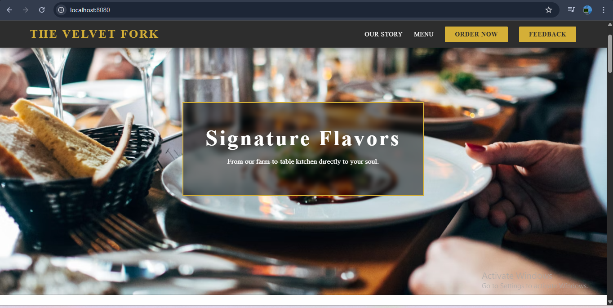
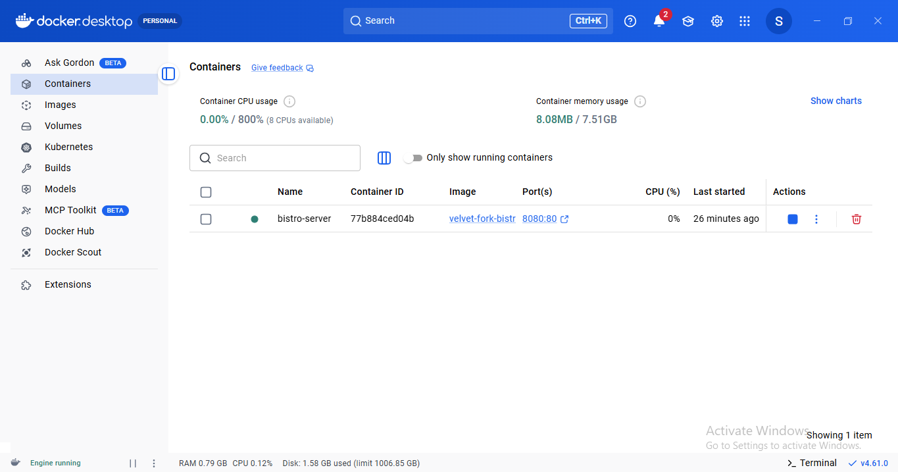

# 🐳 Web Server Containerization with Docker

## Project Name: The Velvet Fork Restaurant Website

#### CodeAlpha DevOps Internship - Task 2

## 📝 Project Overview

This project focuses on the core DevOps practice of containerization. I have successfully packaged a responsive Restaurant Website into a lightweight Docker container using Nginx. To demonstrate real-world deployment, the local container is exposed to the global internet via a secure Ngrok tunnel.

### What this project contains:

- **Dockerfile:** The blueprint for building our custom web server image.

- **Web Content:** A custom-coded HTML/CSS Restaurant landing page.

- **Container Logic:** Port mapping (8080:80) to bridge the host machine and the container.

- **Global Tunnel:** Integration with Ngrok for cross-device access (Mobile/Tablet).

---

## 🏗️ Architecture & Workflow

The workflow follows a standard DevOps "Build-Ship-Run" pipeline:

* **Code:** Developer creates the web files and the Dockerfile.

* **Build:** Docker Engine reads the Dockerfile to create an Image.

* **Run:** Docker creates a Container from that image.

* **Expose:** The internal Nginx server (Port 80) is mapped to the Local Host (Port 8080).

* **Tunnel:** Ngrok generates a public URL to allow external traffic to reach the local container.

---
## 🛠️ Tech Stack

|Category | Technology|
|:---:| :---:|
|Containerization | Docker Desktop|
|Web Server | Nginx (Alpine Linux based)|
|Environment | WSL 2 (Windows Subsystem for Linux)|
|Exposure | Ngrok (Secure Tunneling)|
|Frontend | HTML5, CSS3|
---

## 🚀 Local Deployment 

To get this project running on your machine:

- **Clone the Repo:**
Bash
git clone https://github.com/sakshisalunkhe601/CodeAlpha_VelvetFork

cd CodeAlpha_VelvetFork

- **Build the Image:**
Bash

docker build -t restaurant-server .

- **Run the Container:**
Bash

docker run -d -p 8080:80 --name codealpha-task4 restaurant-server

Access: Visit http://localhost:8080

- **Global Access (Ngrok):**
Bash

ngrok http 8080

---

## 📁 Repository Structure

Plaintext
📂 CodeAlpha_VelvetFork
|
├── 📄 Dockerfile         # Docker instructions
|
├── 📄 index.html         # Restaurant website code
|
├── 📄 README.md          # Project documentation
|
└── 📂 images             # Screenshots for documentation

---

## 🎓 What I Learned from CodeAlpha

Through this task at CodeAlpha, I gained hands-on experience in:

* **Dockerization:** How to convert static code into a portable, scalable image.

* **Image Optimization:** Using nginx:alpine to keep the deployment size small and secure.

* **Networking:** Understanding port forwarding and managing traffic between the host and the container.

* **Troubleshooting:** Managing WSL 2 and Docker Engine synchronization.

---

## 🚩 Internship Milestones

**✅Repository Naming:** CodeAlpha_Web_Server_using_Docker

**✅Containerization:** Custom Nginx-Alpine image built and optimized for production.

**✅Global Access:** Integrated Ngrok tunnel to bypass NAT and expose local containers to the internet.

**✅DevOps Workflow:** Fully implemented the Build → Ship → Run lifecycle.

---

## 📸 Project Screenshots 
**1) Local Site: A screenshot of browser at localhost:8080.**

**2) Docker Desktop: A screenshot showing the "Green Whale" and your running container.**

**3) Mobile View: A photo or screenshot of phone opening the Ngrok link.**

---

### **🤝 Connect with Me on LinkedIn**
[Sakshi Salunkhe DevOps Intern @ CodeAlpha](www.linkedin.com/in/sakshi-salunkhe-758005319)